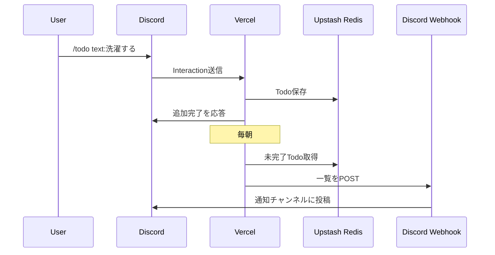

# Discord Todo Bot on Vercel

Discord の Slash Command で Todo を管理しつつ、毎朝 Discord Webhook に未完了 Todo を通知する最小構成です。




## できること

- `/todo text:...` で Todo 追加
- `/todo-list` で Todo 一覧取得
- `/todo-done id:...` で完了
- `/info topic:<topic-name>` のように固定リンクを返す
- 毎朝 JST 8時台に未完了 Todo を Discord に自動通知

## 技術構成

- Next.js App Router
- Vercel Functions
- Vercel Cron
- Discord Interactions Endpoint
- Upstash Redis
- Discord Incoming Webhook

## 必要な環境変数

`.env.example` を参照してください。

最低限必要なのは以下です。

- `DISCORD_APPLICATION_ID`
- `DISCORD_PUBLIC_KEY`
- `DISCORD_BOT_TOKEN`
- `DISCORD_WEBHOOK_URL`
- `UPSTASH_REDIS_REST_URL`
- `UPSTASH_REDIS_REST_TOKEN`
- `CRON_SECRET`

開発用にギルドコマンドで素早く反映したい場合は `DISCORD_GUILD_ID` も入れてください。

## 事前準備

### 1. Discord アプリを作る

Discord Developer Portal で新しいアプリを作ります。

必要な値:

- Application ID
- Public Key
- Bot Token

### 2. アプリのインストール設定

Guild Install で次を有効にしてください。

- `applications.commands`
- `bot`

`bot` の権限は最小なら `Send Messages` で十分です。

### 3. Incoming Webhook を作る

毎朝通知を送りたいチャンネルで Webhook URL を作り、 `DISCORD_WEBHOOK_URL` に入れます。

### 4. Upstash Redis を作る

Vercel Marketplace から Upstash Redis をつなぐか、Upstash 側でデータベースを作って以下を取得します。

- `UPSTASH_REDIS_REST_URL`
- `UPSTASH_REDIS_REST_TOKEN`

## ローカル準備

```bash
cp .env.example .env
npm install
npm run register:commands
npm run dev
```

ローカルの `next dev` は Discord から直接叩けないので、Interations Endpoint の設定は本番 URL を使う前提です。

## Vercel デプロイ

### 1. GitHub に push

```bash
git init
git add .
git commit -m "init discord todo bot"
```

そのあと GitHub に push します。

### 2. Vercel に Import

Vercel で GitHub リポジトリを Import します。

### 3. Environment Variables を設定

Vercel プロジェクトに `.env.example` の値を入れます。

`CRON_SECRET` は十分長いランダム文字列にしてください。

### 4. Production Deploy

初回は必ず production deploy してください。

### 5. Discord の Interactions Endpoint URL を設定

以下を Discord Developer Portal の Interactions Endpoint URL に入れます。

```text
https://YOUR_DOMAIN/api/discord/interactions
```

この endpoint は PING に PONG を返し、署名検証も行います。

### 6. コマンド登録

Vercel の Environment Variables が入った状態で、ローカルから production 用にコマンド登録します。

```bash
vercel env pull .env.local
npm run register:commands
```

開発中は `DISCORD_GUILD_ID` を入れてギルドスコープ登録にすると反映が速いです。

## `/info` の編集方法

### 方法A

`lib/info-config.ts` を直接編集して再デプロイします。

### 方法B

`INFO_MAP_JSON` を環境変数で入れます。

例:

```json
{
  "topic": {
    "title": "title",
    "url": "url",
    "aliases": ["title1", "title2"]
  },
}
```

## Cron の仕様

`vercel.json` で以下を設定しています。

```json
{
  "$schema": "https://openapi.vercel.sh/vercel.json",
  "crons": [
    {
      "path": "/api/cron/daily-todo",
      "schedule": "0 23 * * *"
    }
  ]
}
```

これは UTC 23:00 なので JST では朝 8時です。8時台のどこかで実行されます。


## 補足

- 毎朝通知は二重送信を避けるため JST 日付キーでガードしています。
- cron route には `CRON_SECRET` チェックを入れています。
- 日記本文はこの Bot の管理対象にしていません。
